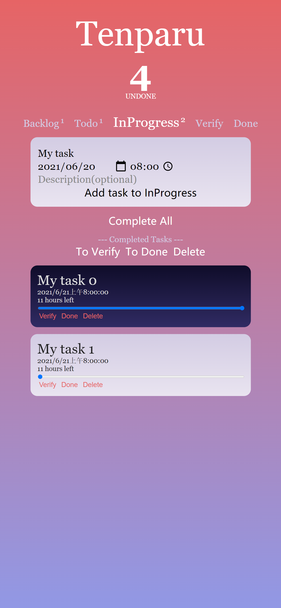
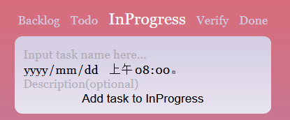
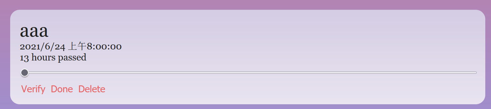
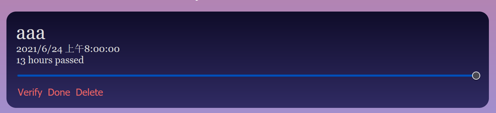
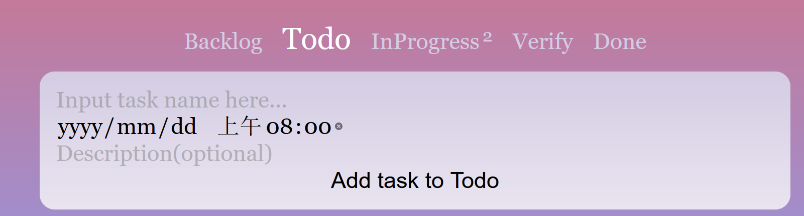

# Tenparu

## Features

- Common to-do list features

  - Add/Remove a task and show task list.

  - Label task as "Completed".

  - Task progress bar

  - Complete/Reset progress of all the tasks in the current stage.

  - Due date and time

  - Complete a single task./Move a single task to "Done".

  - Delete all completed tasks in the current stage

  - Display total number of undone tasks.

- Kanban features

  - 5 stages of tasks (Backlog, Todo, In Progress, Verify, Done)*

  - Switch between stages.

  - Display number of tasks in each stage.

  - Advance stage of a task./Directly move a task to "Done".

  - Advance stage of all completed tasks in the current stage./Directly move all completed tasks in the current stage to "Done".

  - Delete all "Done" tasks.

  - Display total number of tasks of each stage.

- Data/state persistence (through `localStorage`)

## "How-To"s

### Add a Task

1. Write the task name in input box with "Input task name here".

2. Choose due date and time in the input panel below it.

3. (Optional) Write description in the input box "Description(optional)".

4. Press the "Add task to [stage name]" button

If user want to add task to stage other than "InProgress", see "Switch to Stage" part.

### Manipulate a Single Task

- Click the "Delete" button to delete it.

- Click the "Done" button to move it to "Done".

- Click the button with the name of next stage("Verify" here) to move it to the next stage.

- Slide the slide bar to set its progress.

### Switch to Stage

Click the stage name to switch stage.

### Manipulate Multiple Tasks in Current Stage

- Progress setting

  - Click the "Complete All" button to set all task completed.

  - Click the "Reset All To 0%" button to set all progresses of tasks to 0%.

- Completed task manipulating

  - Click the "Delete" button to delete them.

  - Click the "To Done" button to move them to "Done".

  - Click the button with the name of next stage("To InProgress" here) to move them to the next stage.

All the tasks in "Done" stage are considered as completed. User can remove them all by clicking "Remove Done Tasks".
