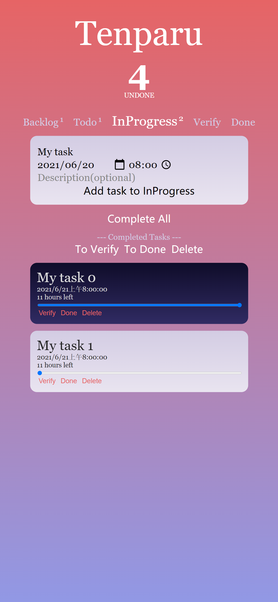
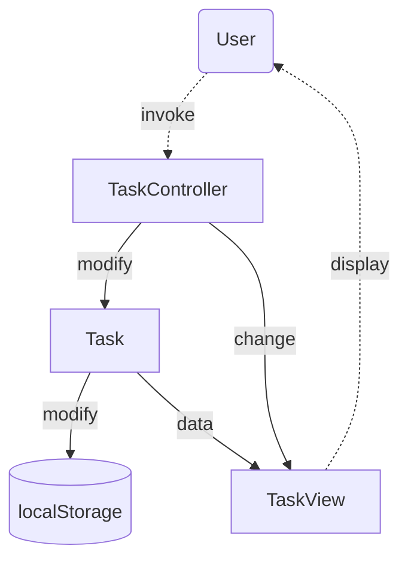

# Tenparu

## Features

- Common to-do list features
  
  - Adding and removing tasks
  
  - Due date and time
  
  - Labeling task as "Completed"
  
  - Task progress bar
  
  - Manipulation of a single task or all tasks in the page
  
  - Display total number of undone tasks

- Kanban features
  
  - 5 stages of tasks (Backlog, Todo, In Progress, Verify, Done)
  
  - Display number of tasks in each stage
  
  - Advance stage of tasks (or directly move it to "Done")

- Data/state persistence (through `localStorage`)

## MVC Framework

The [script](script.ts) of the page is implemented under MVC framework. The dependency is given as below:

